# Organograma Funcional — Vendedor IA V1

Desenho conceitual. **Nada aqui está implementado.** Baseline `25691ac`.
Legenda de estado em todos os diagramas:

- **verde** = existe hoje e funciona
- **amarelo** = existe parcialmente, ou existe e está escondido
- **vermelho** = não existe

---

## 1. Hierarquia humana

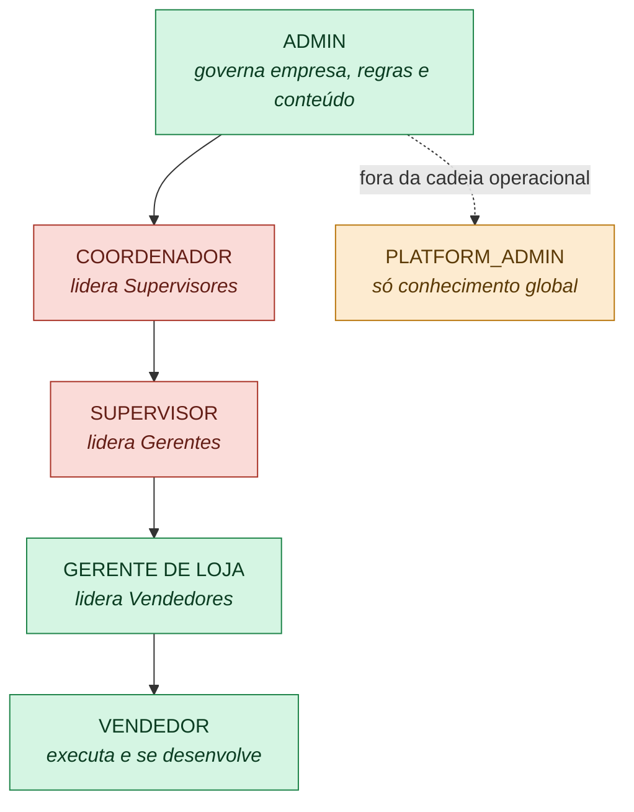

**Leitura:** dos cinco níveis, dois não existem. E `PLATFORM_ADMIN` existe no enum
mas **não tem nenhuma rota HTTP** — está fora da cadeia de propósito (governa só
conhecimento global, nunca pessoas).

---

## 2. Módulos do produto

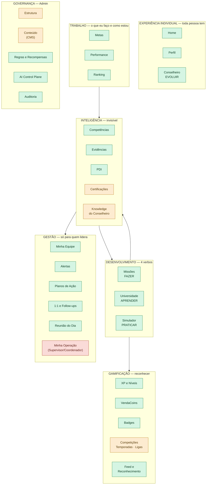

**Onde Treinador e Academia foram parar:** não estão no diagrama porque deixam de
ser módulo. O conteúdo da Academia entra em **Universidade**; o Playbook do Treinador
vira **conteúdo governado** consumido por Universidade, Simulador e Conselheiro.

---

## 3. Permissões — as quatro dimensões

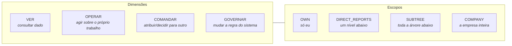

**Regra congelada (§6 da etapa):**

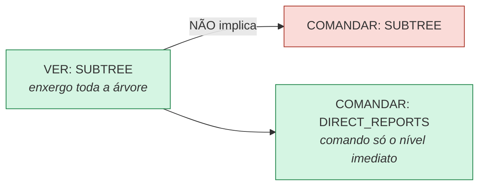

**E a regra de falha:**

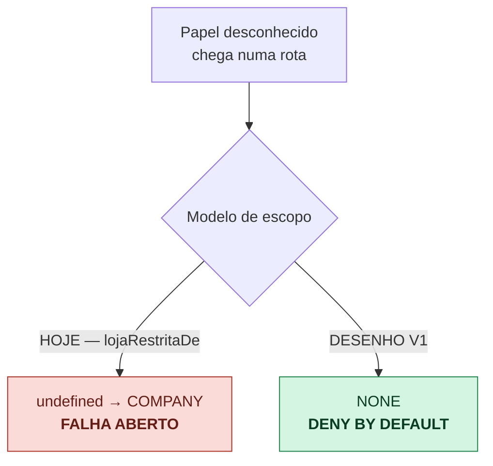

---

## 4. Fluxo de desenvolvimento — o loop

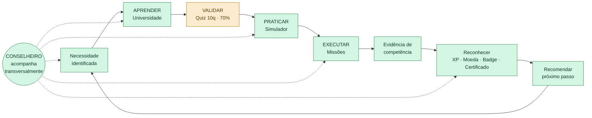

**Freio deliberado (§51 da etapa):** nem todo gap vira curso + simulação + missão +
alerta. A regra de desenho é:

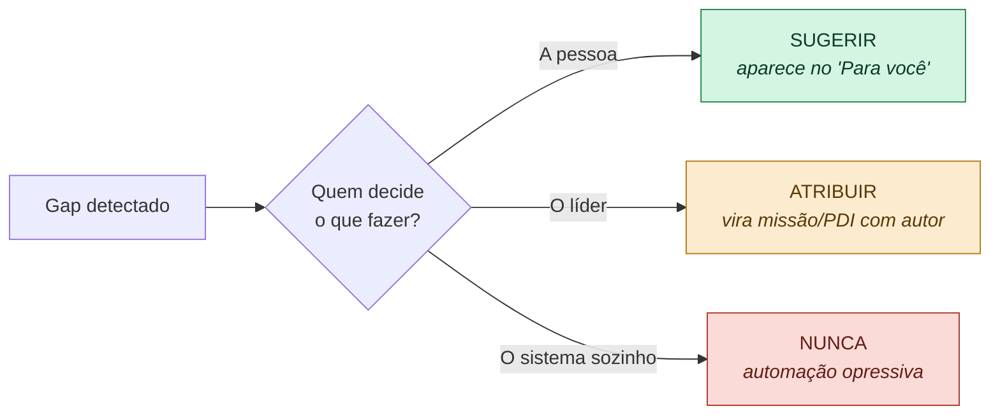

---

## 5. Fluxo de gestão

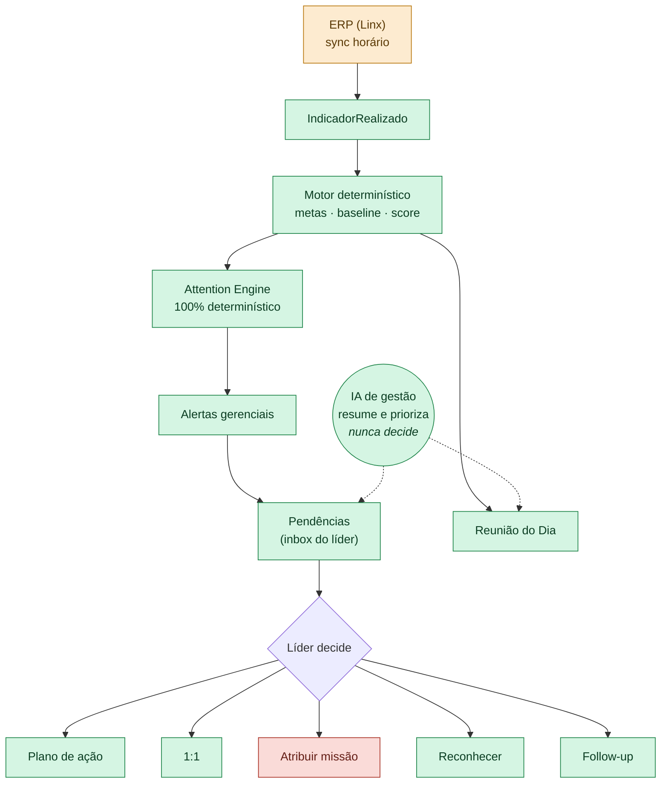

---

## 6. Arquitetura de IA

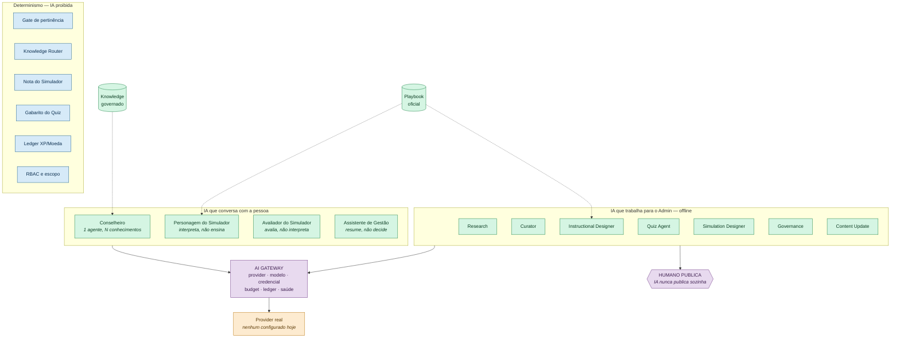

---

## 7. Integração entre módulos — o grafo que importa

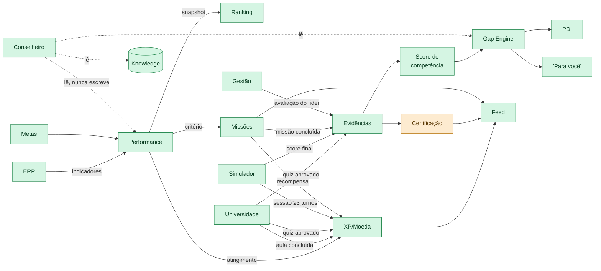

**O que esse grafo revela:** **Evidência é o barramento central do produto.** Quatro
fontes escrevem nela (quiz, simulação, missão, avaliação do líder) e três consumidores
leem (score/gap, PDI, certificação). Ela já existe e já está ligada — e é por isso que
"Inteligência de Desenvolvimento" não precisa virar módulo visível.

---

## 8. Fronteiras de privacidade

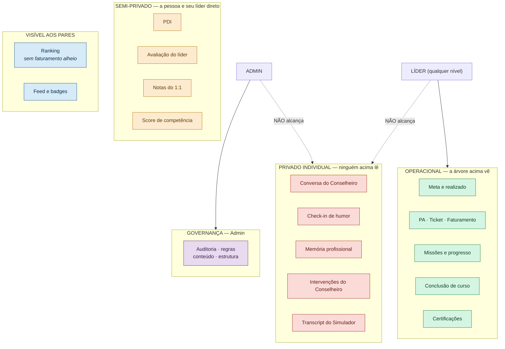

**A travessia legítima da fronteira** — a pessoa leva, o sistema não relata:

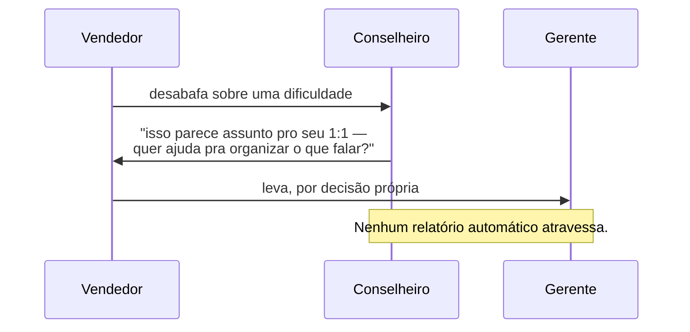

**O Simulador tem um trade-off aberto:** hoje a transcrição é do usuário. Se a
liderança passar a ver o transcript, o espaço de prática vira vigilância. Recomendação
de desenho: o líder vê **conclusão, score e competência**; o **feedback detalhado e o
transcript ficam com quem praticou**. Decisão humana no Decision Board (D-07).

---

## 9. Governança do Admin

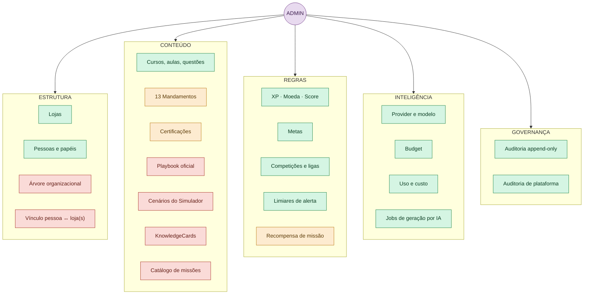

**As cinco superfícies vermelhas em CONTEÚDO são o trabalho real de "Admin governa sem
terminal".** Hoje playbook, cenários, missões e conhecimento só existem via seed ou script.

---

## 10. Jornada por papel — navegação proposta

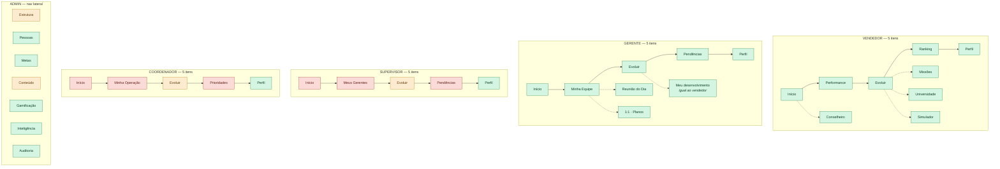

**Princípio de desenho:** todo papel tem **Início · [seu escopo] · Evoluir · [suas
pendências] · Perfil**. Cinco itens, sempre. O que muda entre papéis são os itens 2 e 4,
nunca a quantidade.

E **"Evoluir" é igual para todos** — porque todo mundo, inclusive o coordenador, é uma
pessoa em desenvolvimento. É a diferença entre um app de gestão e um sistema de trabalho.

---

## 11. Estado atual × desenho, em um diagrama

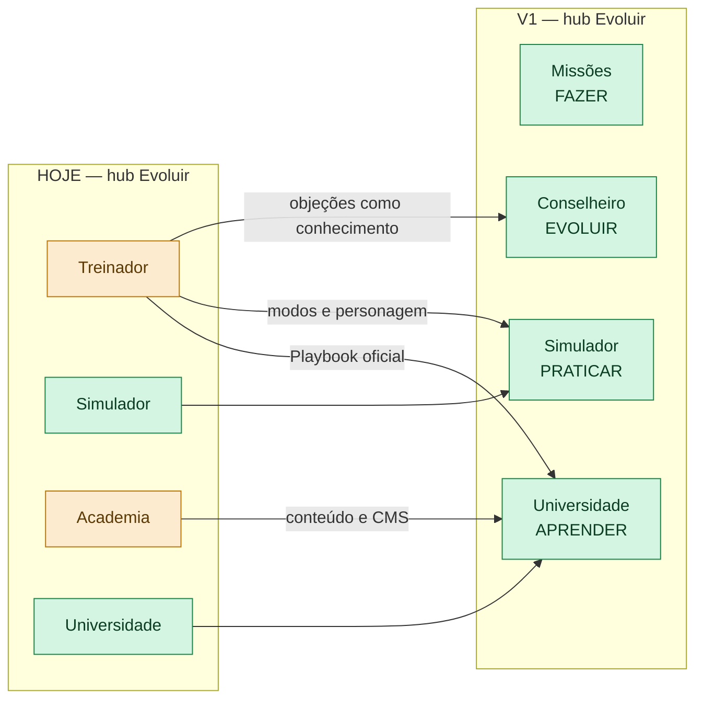

**Nenhuma seta aponta para o lixo.** Essa é a leitura que este organograma existe
para provar.
